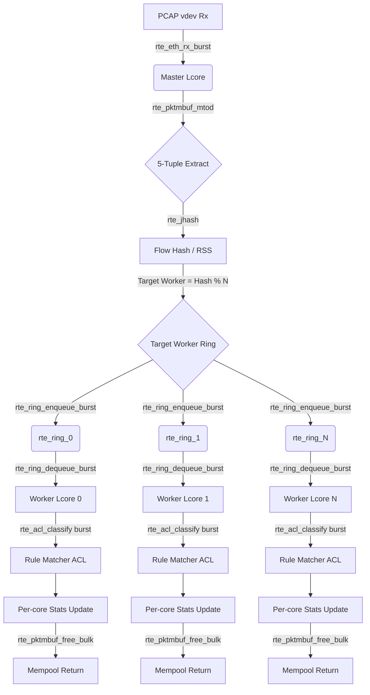

# SPIFast - Hệ thống phân loại gói tin hiệu năng cao dùng DPDK

SPIFast là một hệ thống Kiểm tra gói tin nông (Shallow Packet Inspection - SPI) hiệu năng cao được xây dựng bằng ngôn ngữ C11 và thư viện DPDK. Hệ thống thực hiện phân loại lưu lượng mạng dựa trên các trường tiêu đề 5-tuple (IP nguồn, IP đích, Cổng nguồn, Cổng đích, Giao thức) ở tốc độ đường truyền Gigabit (Line-rate) nhờ vào kiến trúc đường ống đa lõi không dùng khóa (lock-free multi-core pipeline architecture).

## 🚀 Tính năng nổi bật

* **Kiến trúc Không-sao-chép (Zero-Copy):** Phân tích cú pháp gói tin trực tiếp ngay trên bộ nhớ (in-place) sử dụng các phân vùng mempool của DPDK.
* **Đa luồng Không-dùng-khóa (Lock-Free Multi-Threading):** Các lõi Master (Nhận/Phân phối) và Worker giao tiếp trực tiếp với nhau thông qua hàng đợi `rte_ring`.
* **Cân bằng tải động:** Cơ chế phần mềm RSS (Sử dụng hàm băm Jenkins Hash) đảm bảo tính đồng nhất luồng dữ liệu (flow affinity) một cách định trước.
* **Cập nhật luật thời gian thực (Hot-Reloadable):** Hỗ trợ nạp động bộ luật mới qua Unix Domain Sockets bằng cơ chế đệm kép (Double Buffering) và hoán đổi con trỏ nguyên tử (Atomic Pointer Switch) trên context DPDK ACL chỉ trong một chu kỳ máy. Cơ chế lock-free này giúp hệ thống vận hành liên tục (**Zero-Downtime**), không rớt gói (**Zero-Packet-Loss**) và duy trì Line-rate ổn định (tuy nhiên, các gói tin nằm chung trong một burst/batch đã lấy ra khỏi hàng đợi trước thời điểm swap vẫn sẽ được xử lý trọn vẹn theo bộ luật cũ để đảm bảo tính nhất quán).
* **Bộ lọc tối ưu bằng DPDK ACL:** Sử dụng thư viện `librte_acl` (hỗ trợ tập lệnh vector hóa AVX2/AVX-512) phân loại lưu lượng hàng loạt (burst classification), kết hợp file cấu hình luật định dạng Section (`[GROUPS_SECTION]` và `[FILTERS_SECTION]`) mềm dẻo.

---

## 🛠️ Cấu hình hệ thống chạy

Hệ thống được thiết kế và kiểm thử tối ưu hóa trên cấu hình phần cứng và hệ điều hành thực tế như sau:

* **Bộ vi xử lý (CPU):** Intel Core i7-13700HX (Raptor Lake, 16 lõi / 24 luồng, hỗ trợ tập lệnh AVX2, AVX-VNNI).
* **Bộ nhớ trong (RAM):** 16 GB DDR5 4800 MT/s (Kênh đôi - Dual Channel hoạt động tối ưu băng thông).
* **Ổ lưu trữ (SSD):** Samsung PM9A1 1 TB NVMe PCIe Gen4 x4.
* **Hệ điều hành (OS):** Ubuntu Desktop 24.04 LTS (Noble Numbat, Linux Kernel >= 6.8).
* **Cấu hình bổ sung:** Yêu cầu cấp phát bộ nhớ Hugepages (1024 trang kích thước 2MB, tổng cộng 2 GB RAM) và kích hoạt VFIO/IOMMU cho DPDK.
* **Trình biên dịch & Công cụ:** GCC (>= 13.2+), Meson (>= 1.3.2) và Ninja.

---

## 🔄 Các chế độ hoạt động của hệ thống (Modes of Operation)

Dự án hoạt động ở ba chế độ giả lập mạng offline trên PC cá nhân (không yêu cầu card mạng rời vật lý):

### 1. Chế độ Native Mode (PCAP Preload)
Chế độ này nạp trước (preload) toàn bộ tệp PCAP vào bộ đệm RAM để xử lý trực tiếp từ bộ nhớ, bỏ qua (bypass) hoàn toàn nhân Linux Kernel và ngăn xếp mạng tiêu chuẩn.
* **Cơ chế hoạt động:** DPDK sử dụng PCAP Poll Mode Driver (PMD) để tải trước toàn bộ gói tin từ tệp PCAP lên RAM. Quá trình nhận và xử lý gói tin thực chất là truy xuất bộ nhớ trực tiếp (Direct Memory Access), giúp loại bỏ hoàn toàn độ trễ I/O.
* **Ưu điểm:** Đạt hiệu năng xử lý gói thô tối đa tuyệt đối (lên tới hàng chục Gbps và hàng chục triệu pps), giúp kiểm tra năng lực tính toán thuần túy của ứng dụng.
* **Nhược điểm:** Phụ thuộc hoàn toàn vào dung lượng RAM trống và kích thước `mbuf` pool được cấp phát. Dễ gây tràn RAM hoặc cạn kiệt bộ nhớ nếu sử dụng tệp PCAP quá lớn (khuyến nghị chỉ dùng cho tệp PCAP nhỏ hơn 8.000 gói tin).

### 2. Chế độ TCPReplay Mode (Veth Interface)
Chế độ này sử dụng công cụ `tcpreplay` để phát lại luồng dữ liệu từ file PCAP qua cặp cổng mạng ảo (`veth`) của hệ điều hành, mô phỏng sát nhất mô hình nhận gói từ interface thực tế.
* **Cơ chế hoạt động:** `tcpreplay` chạy ở nền sẽ bơm gói tin ra cổng ảo `veth1` với tốc độ tối đa (topspeed `-t`). Gói tin đi qua mạng nhân Linux Kernel trung chuyển tới cổng ảo `veth0`. Ứng dụng DPDK lắng nghe trên `veth0` thông qua driver PCAP PMD kết nối thư viện `libpcap` (AF_PACKET) để kéo gói tin về Userspace xử lý.
* **Ưu điểm:** Mô phỏng chính xác mô hình xử lý gói tin qua mạng, hỗ trợ chạy kiểm thử các tệp PCAP dung lượng lớn (hàng triệu gói tin) mà không lo tràn RAM hay cạn kiệt bộ nhớ mbuf pool.
* **Nhược điểm:** **Không thực sự bypass được Linux Kernel**. Gói tin phải đi vòng qua ngăn xếp mạng của nhân hệ điều hành (Kernel space) trên cặp `veth` ảo rồi mới được DPDK thu nhận lại, dẫn đến độ trễ do chuyển ngữ cảnh (Context Switch) và sao chép bộ nhớ giữa User/Kernel space (hiệu năng chậm hơn chế độ Native Mode).

### 3. Chế độ đo tốc độ lý thuyết thuần túy (Raw Throughput - Bypass SPIFast)
Chế độ này đo đạc khả năng truyền tải dữ liệu thô tối đa của công cụ `tcpreplay` bơm trực tiếp vào giao tiếp mạng ảo `veth` của nhân hệ điều hành Linux khi hoàn toàn bỏ qua phần mềm xử lý gói tin SPIFast.
* **Cơ chế hoạt động:** `tcpreplay` phát gói tin vòng lặp qua `veth1` -> `veth0` mà không chạy phần mềm `spifast`. Một tiến trình giám sát sẽ ghi nhận số lượng byte và gói tin thực tế nhận được qua cổng `veth0` của hệ điều hành để tính Mbps và pps thô.
* **Ưu điểm:** Xác định giới hạn truyền tải tối đa (ceiling/ngưỡng trần) của giao tiếp ảo `veth` trong nhân Kernel Linux.
* **Nhược điểm:** Không thực hiện xử lý hay phân loại gói tin, chỉ mang ý nghĩa làm mốc đối chiếu hiệu năng (baseline).

---

## ⚙️ 1. Cài đặt, Cấu hình và Biên dịch dự án

Thực hiện lần lượt các bước dưới đây bằng các script đã được tích hợp sẵn trong thư mục `scripts/` để thiết lập môi trường hệ thống, biên dịch DPDK cục bộ và tiến hành build dự án.

### Bước 1.1: Cài đặt các gói phụ thuộc hệ thống
```bash
chmod +x scripts/setup_dependencies/install_dependencies.sh
sudo ./scripts/setup_dependencies/install_dependencies.sh
```

### Bước 1.2: Thiết lập môi trường ảo Python (Phục vụ cho các script sinh test)
```bash
chmod +x scripts/setup_python/setup_venv.sh
./scripts/setup_python/setup_venv.sh

# Kích hoạt môi trường ảo và cài đặt thư viện Scapy (dành cho bộ sinh kiểm thử tự động)
source venv/bin/activate
pip install scapy
```

### Bước 1.3: Tải và Biên dịch DPDK cục bộ
Dự án sử dụng DPDK 24.11 được cài đặt cục bộ độc lập ngay trong thư mục `third_party/`.
```bash
chmod +x scripts/setup_dpdk/setup_dpdk.sh
./scripts/setup_dpdk/setup_dpdk.sh
```

### Bước 1.4: Cấp phát bộ nhớ Hugepages (Bắt buộc chạy lại sau mỗi lần khởi động máy)
DPDK yêu cầu cấp phát bộ nhớ Hugepages để thiết lập các pool bộ nhớ không-sao-chép. Script sẽ tự động cấp phát **1024 trang bộ nhớ 2MB (tổng cộng 2 GB RAM)** tại `/dev/hugepages`.
```bash
chmod +x scripts/setup_hugepages/setup_hugepages.sh
sudo ./scripts/setup_hugepages/setup_hugepages.sh
```

### Bước 1.5: Biên dịch dự án SPIFast
Thiết lập biến môi trường `PKG_CONFIG_PATH` trỏ tới DPDK cục bộ vừa biên dịch để cấu hình build bằng `meson` và biên dịch bằng `ninja`:
```bash
export PKG_CONFIG_PATH="$PWD/third_party/dpdk-24.11/build/meson-uninstalled"
meson setup build
ninja -C build
```

Sau khi biên dịch thành công, 3 file thực thi (binary) sẽ được tạo ra trong thư mục `build/`:

* **`spifast`**: Ứng dụng phân loại SPI bản Production đã được tối ưu hóa kịch khung.
* **`spifast_debug`**: Phiên bản chạy ở chế độ Debug kèm theo các cờ kiểm thử tính đúng đắn của chức năng.
* **`spi_cli`**: Công cụ dòng lệnh hỗ trợ nạp lại cấu hình thời gian thực (live reload).

### Bước 1.6: Kiểm tra và xác thực cấu hình môi trường
Sau khi hoàn thành cài đặt, bạn hãy chạy script sau dưới quyền root để tự động chẩn đoán phần cứng, Hugepages, trạng thái driver và tính sẵn sàng của các thư viện phụ thuộc:
```bash
chmod +x scripts/test_setup/test_setup.sh
sudo ./scripts/test_setup/test_setup.sh
```

---

## 🧪 2. Sinh dữ liệu kiểm thử và Phân tích PCAP

Trước khi vận hành dự án, bạn cần chuẩn bị các file lưu vết gói tin (`.pcap`) và luật tương ứng để cấp cho ứng dụng phân tích.

### Bước 2.1: Tải các mẫu gói tin Wireshark chuẩn
Sử dụng script để tải tự động các tệp PCAP mẫu (ví dụ: HTTP, TLS 1.3) từ kho lưu trữ kiểm thử chính thức của Wireshark:
```bash
chmod +x scripts/setup_wireshark_samples/download_wireshark_samples.sh
./scripts/setup_wireshark_samples/download_wireshark_samples.sh
```

### Bước 2.2: Sinh dữ liệu lưu lượng giả lập (Mô phỏng quy mô lớn)
Dự án cung cấp các script Python sử dụng thư viện `scapy` để tự động sinh ra các tệp PCAP giả lập với số lượng gói tin lớn (mặc định 1.000.000 gói tin) nhằm phục vụ đo kiểm hiệu năng:
```bash
# Lưu ý: Đảm bảo môi trường ảo venv đã được kích hoạt (source venv/bin/activate)

# Sinh lưu lượng cân bằng (Balanced Traffic)
python tests/gen_tests/gen_balanced_traffic.py

# Sinh lưu lượng mạng viễn thông (Telco Traffic)
python tests/gen_tests/gen_telco_traffic.py
```
Các tệp PCAP sinh ra sẽ được lưu vào thư mục `tests/data/pcap/`.

### Bước 2.3: Phân tích trước các file PCAP bằng Python
Để đối chiếu so sánh kết quả và phân tích thống kê phân bố gói tin trước khi cho chạy so khớp qua DPDK, bạn hãy chạy script phân tích:
```bash
python tests/analyze_pcap/analyze_pcap.py
```
Báo cáo phân tích thống kê chi tiết cho từng tệp PCAP sẽ được xuất ra file dạng văn bản tương ứng tại thư mục `tests/analyze_pcap/`.


---

## 🏃 3. Vận hành dự án

### Chạy ở chế độ Native Mode
```bash
sudo ./tests/judge/run_project_native.sh
```

### Chạy ở chế độ truyền dữ liệu với `tcpreplay`
```bash
sudo ./tests/judge/run_project_tcpreplay.sh
```

### Cập nhật luật thời gian thực (Hot-Reloading)

Trong khi ứng dụng `spifast` vẫn đang chạy, bạn hãy mở mới 1 cửa sổ terminal. Bạn có thể chỉnh sửa file luật `spi_rules.conf`, nhớ ấn save rồi tiến hành nạp trực tiếp bộ luật mới vào hệ thống mà không làm rớt bất kỳ gói tin nào:

```bash
sudo ./build/spi_cli reload_rules ./spi_rules.conf
```

---

## 🧪 4. Đo kiểm hiệu năng (Benchmarking) & Kiểm thử tính đúng đắn

### Kiểm tra tính đúng đắn của chức năng (Functional Correctness)

Kịch bản này sẽ tự động sinh ra một bộ file PCAP định trước bao phủ toàn bộ các trường hợp biên và kiểm thử lỗi, đẩy chúng qua đường ống xử lý SPI, sau đó đối chiếu kết quả thực tế thu được với kết quả kỳ vọng ban đầu.

```bash
source venv/bin/activate
sudo ./tests/judge/run_check_correctness.sh
```

### Đo kiểm ở chế độ Native Mode
Chạy đo kiểm hiệu năng ở chế độ nạp trước gói tin vào RAM:
```bash
sudo ./tests/judge/run_benchmark_native.sh
```

### Đo kiểm tốc độ truyền tải tối đa lý thuyết TCPReplay Mode
Đo tốc độ truyền gói thô tối đa của `tcpreplay` qua `veth` khi bypass SPIFast:
```bash
sudo ./tests/judge/run_get_raw_throughput.sh
```

### Đo kiểm ở chế độ TCPReplay Mode
Chạy đo kiểm hiệu năng xử lý gói thực tế qua giao tiếp mạng ảo:
```bash
sudo ./tests/judge/run_benchmark_tcpreplay.sh
```

### Nơi xem toàn bộ Kết quả đầu ra (Results Output)

Toàn bộ quá trình chạy chương trình, file log chi tiết và kết quả đo kiểm hiệu năng (Benchmarks) sẽ được tự động lưu lại và bạn có thể xem toàn bộ tại thư mục **[tests/results/](tests/results/)** dưới dạng các file định dạng `.csv` và `_log.txt`.

Để xem hướng dẫn chi tiết về khung kiểm thử, vui lòng tham khảo [Tài liệu hướng dẫn đo kiểm (Benchmarking Guide)](tests/judge/README.md).

---
## 5. Kết quả đo đạc thực tế 

### 5.1. Kiểm tra tính đúng đắn của hệ thống (Functional Correctness)

Trước khi thực hiện đo kiểm hiệu năng, hệ thống đã phải vượt qua các bài kiểm thử khắt khe về tính đúng đắn khi xử lý gói tin (phân loại đúng luật, không bỏ sót gói). Dưới đây là kết quả kiểm thử chức năng tự động trích xuất từ file `tests/results/testcase_results.csv`:

| Tiêu chí (Metric) | Kết quả (Value) |
| :--- | :--- |
| **Tổng số gói tin (Total Packets)** | 329 |
| **Phân loại khớp (Matched)** | 329 |
| **Bỏ sót (Missing)** | 0 |
| **Sai lệch (Mismatched)** | 0 |
| **Độ chính xác (Accuracy)** | **100.00%** |

---

### 5.2. Bảng kết quả Hiệu năng Benchmarks (Thực tế vs. Tối đa lý thuyết)

#### 5.2.1. Chế độ đo tốc độ lý thuyết thuần túy (Raw Throughput)

| File PCAP | Thông lượng (Throughput) | Tốc độ gói tin (Flow Rate) |
| :--- | :--- | :--- |
| `balanced_traffic.pcap` | **2,942.94 Mbps** | 627,693 pps |
| `telco_traffic.pcap` | **3,062.50 Mbps** | 655,389 pps |
| `tls13-rfc8446.pcap` | **1,170.35 Mbps** | 448,730 pps |
| `http.pcap` | **110.58 Mbps** | 59,840 pps |
| `func_test.pcap` | **925.60 Mbps** | 1,317,882 pps |

#### 5.2.2. Chế độ Native Mode

| File PCAP | Thông lượng (Throughput) | Tốc độ gói tin (Flow Rate) |
| :--- | :--- | :--- |
| `tls13-rfc8446.pcap` | **45,996.31 Mbps** | 19,038,208 pps |
| `http.pcap` | **45,147.49 Mbps** | 27,262,976 pps |
| `func_test.pcap` | **14,806.26 Mbps** | 27,297,929 pps |
| `balanced_traffic.pcap` | *0.00 Mbps* | *⚠️ Không chạy được (Tràn RAM)* |
| `telco_traffic.pcap` | *0.00 Mbps* | *⚠️ Không chạy được (Tràn RAM)* |

#### 5.2.3. Chế độ TCPReplay Mode

| File PCAP | Thông lượng (Throughput) | Tốc độ gói tin (Flow Rate) | % so với Lý thuyết thuần túy (Throughput / pps) |
| :--- | :--- | :--- | :--- |
| `balanced_traffic.pcap` | **2,187.30 Mbps** | 486,499 pps | **74.32%** / **77.51%** |
| `telco_traffic.pcap` | **2,138.93 Mbps** | 477,438 pps | **69.84%** / **72.85%** |
| `tls13-rfc8446.pcap` | **851.98 Mbps** | 352,640 pps | **72.80%** / **78.59%** |
| `http.pcap` | **74.92 Mbps** | 45,243 pps | **67.75%** / **75.61%** |
| `func_test.pcap` | **479.50 Mbps** | 884,046 pps | **51.80%** / **67.08%** |

---

## 6. Kiến trúc dự án và Sơ đồ hoạt động

### 6.1  Thuật toán cốt lõi và các kỹ thuật tối ưu hóa hiệu năng (HPC Optimizations)

Để đạt được hiệu năng xử lý gói tin tiệm cận tốc độ đường truyền (Line-rate) mà không gây rớt gói, hệ thống áp dụng các thuật toán và kỹ thuật tối ưu hóa HPC sau:

#### 6.1.1. Thuật toán phân luồng và cân bằng tải động (Software RSS Load Balancing)
*   **RSS Hash với `rte_jhash_3words`**: Nhằm duy trì tính nhất quán dòng dữ liệu (Flow Affinity) và giữ bộ đệm L1/L2 của CPU luôn ấm (warm caches), Master Core tính toán mã băm (Hash) dựa trên 5-tuple của gói tin sử dụng hàm Jenkins Hash tối ưu hóa của DPDK:
    ```c
    uint32_t hash = rte_jhash_3words(meta->tuple.src_ip, meta->tuple.dst_ip,
        ((uint32_t)meta->tuple.src_port << 16) | meta->tuple.dst_port,
        meta->tuple.protocol);
    ```
*   **Tối ưu phép chia dư (Fast Modulo)**: Số lượng Worker Core được thiết kế là lũy thừa của 2 (ví dụ: 1, 2, 4, 8...). Nhờ đó, phép toán chia lấy dư (`%`) đắt đỏ được thay thế bằng phép toán logic bit AND (`&`) cực nhanh để xác định Core đích xử lý gói tin:
    ```c
    target_worker = hash & (num_workers - 1);
    ```

#### 6.1.2. Cơ chế thay đổi bảng luật động không khóa (Lock-Free Double-Buffered Rule Table)
Để hỗ trợ vừa chạy phân loại gói tin vừa cập nhật bảng luật cấu hình (Hot-reload) từ CLI mà không gây suy hao hiệu năng do tranh chấp khóa (Lock Contention):
*   **Cơ chế đệm kép (Double Buffering)**: Hệ thống duy trì hai bảng luật song song: `g_rule_table_a` và `g_rule_table_b` (đều được căn lề cache-line).
*   **Con trỏ nguyên tử (Atomic Pointer Switch)**: Một con trỏ nguyên tử `_Atomic(spi_rule_t *) g_active_rules` luôn chỉ tới bảng luật đang kích hoạt. Khi có yêu cầu tải lại luật mới, luồng điều khiển sẽ parse luật mới vào bảng đệm ẩn (shadow table), sau đó thực hiện tráo đổi con trỏ bằng lệnh ghi nguyên tử đồng bộ bộ nhớ giải phóng (`atomic_store_explicit` với `memory_order_release`):
    ```c
    atomic_store_explicit(&g_active_rules, shadow, memory_order_release);
    ```
*   **Độc giả không khóa (Lock-Free Reader)**: Worker Core nạp con trỏ bảng luật một lần cho mỗi burst gói tin bằng lệnh đọc thu nhận (`atomic_load_explicit` với `memory_order_acquire`). Worker xử lý trọn vẹn burst hiện tại trên bảng luật cũ trong khi bảng luật mới đã được swap cho burst kế tiếp, đảm bảo tính nhất quán dữ liệu mà không cần dùng Mutex hay Spinlock.

#### 6.1.3. Phân loại gói tin hàng loạt bằng thư viện DPDK ACL (Burst Classification)
Để xử lý phân loại lưu lượng ở tốc độ hàng chục triệu gói tin mỗi giây:
*   **DPDK ACL (Access Control List)**: Hệ thống sử dụng thư viện `librte_acl` được tối ưu bằng các tập lệnh vector hóa (AVX2/AVX-512) để xây dựng cây trie so khớp luật 5-tuple.
*   **Xử lý hàng loạt (Burst Mode)**: Thay vì so khớp từng gói tin đơn lẻ qua vòng lặp tuyến tính (linear search), Worker Core thu thập một lô gói tin (burst) và truyền mảng siêu dữ liệu vào hàm `rte_acl_classify()`. Điều này tối đa hóa khả năng xử lý song song ở cấp độ chu kỳ máy (Instruction-Level Parallelism).

#### 6.1.4. Kỹ thuật nạp trước dữ liệu (Memory Prefetching)
Để che giấu độ trễ truy xuất RAM (Memory Latency Overhead), Worker Core liên tục nạp trước (prefetch) siêu dữ liệu gói tin (`rte_mbuf`) và vùng chứa header của các gói tin tiếp theo vào bộ nhớ cache L1 của CPU trước khi thực tế thao tác trên nó:
```c
if (likely(i + 4 < nb_rx)) {
    rte_prefetch0(bufs[i + 4]);                          // Prefetch mbuf header
    rte_prefetch0(rte_pktmbuf_mtod(bufs[i + 4], void *)); // Prefetch packet payload/headers
}
```

#### 6.1.5. Các kỹ thuật tối ưu hóa HPC khác
*   **Zero-Copy Parser**: Sử dụng macro `rte_pktmbuf_mtod` để ép kiểu trực tiếp con trỏ vùng nhớ gói tin sang các cấu trúc tiêu đề mạng (`struct rte_ipv4_hdr`, `struct rte_tcp_hdr`) mà không cần sao chép bộ nhớ (`memcpy`).
*   **Tránh False Sharing**: Đánh dấu các cấu trúc thống kê cục bộ bằng `__rte_cache_aligned` (căn lề theo cache-line 64 bytes) để đảm bảo mỗi Worker ghi dữ liệu lên vùng nhớ độc lập, tránh xung đột bộ đệm L2/L3 giữa các nhân CPU khác nhau.
*   **Gộp nhóm xử lý (Batching)**: Nhận gói (`rte_eth_rx_burst`), truyền gói (`rte_ring_enqueue_burst`), và giải phóng bộ nhớ (`rte_pktmbuf_free_bulk`) theo từng nhóm (Burst) để giảm thiểu chi phí overhead gọi hàm và tranh chấp khóa của Mempool.

### 6.2. Cấu trúc thư mục mã nguồn (`src/`)

Dưới đây là sơ đồ cây thư mục chi tiết của phân hệ xử lý chính ([src/](file:///c:/Users/ADMIN/Desktop/coding/hpc-spi-classifier/src)) và mô tả vai trò của từng thành phần:

```text
src/
├── main.c           # Điểm khởi đầu (Entry Point), khởi tạo cấu hình DPDK EAL, Mempool, Ring và phân bổ các core
├── common.h         # Định nghĩa các cấu trúc dữ liệu dùng chung (five_tuple_t, spi_rule_t, pkt_metadata_t)
├── master.c/.h      # Logic của Master Core: nhận gói tin từ PCAP/vdev, phân tích và phân phối (Dispatch) tới Worker Cores
├── worker.c/.h      # Logic của các Worker Cores: lấy gói tin từ vòng ring, so khớp luật và giải phóng bộ nhớ gói tin
├── matcher.c/.h     # Bộ so khớp luật Shallow Packet Inspection (SPI) dựa trên 5-tuple của gói tin
├── parser.h         # Bộ phân tích tiêu đề gói tin (L2/L3/L4 Headers Parser) với cơ chế Zero-copy
├── control.c/.h     # Các hàm điều khiển hệ thống, tải tập luật cấu hình và đồng bộ hóa trạng thái
├── stats.c/.h       # Quản lý và in thống kê hiệu năng hệ thống (Mbps, pps, drop/hit rate) định kỳ mỗi 1 giây
└── spi_cli.c        # Tiện ích dòng lệnh (CLI) tương tác điều khiển động hệ thống
```

### 6.3. Sơ đồ dòng dữ liệu (Data Flow & Pipeline Model)

Hệ thống hoạt động theo mô hình Pipeline song song phi trạng thái (Stateless Lock-free Pipeline). Dòng dữ liệu từ khi nhận gói tin cho đến khi xử lý hoàn tất được mô tả qua sơ đồ Mermaid dưới đây:



### 6.4. Chi tiết chức năng các phân hệ

1. **Khởi tạo hệ thống (`main.c`)**: Khởi tạo môi trường DPDK EAL, tạo `rte_mempool` để chứa gói tin, tạo các hàng đợi vòng khóa `rte_ring` và cấu hình cổng mạng ảo `net_pcap`.
2. **Nhận và phân phối gói tin (`master.c`)**: Chạy vòng lặp vô hạn trên lcore Master, liên tục nhận burst gói tin từ cổng mạng ảo. Với mỗi gói tin, Master trích xuất địa chỉ IP, Port và Protocol (5-tuple), sau đó dùng thuật toán `rte_jhash` để tính toán phân bổ tải (Dynamic Load Balancing) và đưa gói tin vào hàng đợi `rte_ring` tương ứng của các Worker Cores.
3. **So khớp luật (`matcher.c`, `parser.h`)**: Tích hợp thư viện **DPDK ACL** (`librte_acl`) để xây dựng cây trie cấu trúc luật. Hỗ trợ định dạng cấu hình hai phân đoạn (`[GROUPS_SECTION]`, `[FILTERS_SECTION]`) cho phép định nghĩa các dải IP CIDR và cổng linh hoạt.
4. **Xử lý song song (`worker.c`)**: Mỗi lcore Worker được gắn với một hàng đợi `rte_ring` riêng. Worker thực hiện poll burst gói tin, sử dụng hàm `rte_acl_classify` để tra cứu bộ luật hàng loạt trên nhiều gói tin cùng lúc (burst classification). Cuối cùng, ghi nhận thông số thống kê cục bộ và giải phóng gói tin hàng loạt bằng `rte_pktmbuf_free_bulk`.
5. **Thống kê hiệu năng (`stats.c`)**: Tổng hợp dữ liệu từ các Worker Cores và in ra màn hình thông lượng (Mbps), tốc độ gói (pps) và tỷ lệ trượt/khớp định kỳ mỗi giây, sử dụng kỹ thuật tránh False Sharing (`__rte_cache_aligned`).

### 6.5. Chi tiết mã nguồn từng file và Cơ chế Debug (`DEBUG_MODE`)

Dưới đây là mô tả chi tiết nhiệm vụ của từng file trong thư mục nguồn và cách thức hoạt động của chế độ **Debug Mode** phục vụ kiểm thử tính đúng đắn (Check Correctness).

#### 6.5.1. Vai trò chi tiết của từng file nguồn
*   **[common.h](file:///c:/Users/ADMIN/Desktop/coding/hpc-spi-classifier/src/common.h)**:
    *   Định nghĩa các hằng số cấu hình hệ thống như số lượng luật tối đa (`MAX_RULES = 128`), số lượng worker tối đa (`MAX_WORKERS = 4`), kích thước của ring buffer (`RING_SIZE = 4096`), và burst size (`BURST_SIZE = 64`).
    *   Định nghĩa kiểu dữ liệu 5-tuple ([five_tuple_t](file:///c:/Users/ADMIN/Desktop/coding/hpc-spi-classifier/src/common.h#L28-L34)) và cấu trúc siêu dữ liệu gói tin ([pkt_metadata_t](file:///c:/Users/ADMIN/Desktop/coding/hpc-spi-classifier/src/common.h#L36-L42)) được lưu tại vùng nhớ riêng (private area) của mbuf.
    *   Khai báo cấu trúc luật ([spi_rule_t](file:///c:/Users/ADMIN/Desktop/coding/hpc-spi-classifier/src/common.h#L45-L50)) được tối ưu hóa căn lề cache-line (`__rte_cache_aligned`) để ngăn ngừa hiện tượng False Sharing.
    *   Khai báo các biến con trỏ bảng luật và ACL context sử dụng kiểu dữ liệu nguyên tử C11 (`_Atomic`) phục vụ cho cơ chế double buffering.
*   **[main.c](file:///c:/Users/ADMIN/Desktop/coding/hpc-spi-classifier/src/main.c)**:
    *   Khởi tạo môi trường DPDK EAL (`rte_eal_init`) và phân tích đối số dòng lệnh (file cấu hình luật thông qua tham số `-r`).
    *   Khởi tạo bộ so khớp luật và khởi động tiến trình con của control plane (`control_thread_start`).
    *   Tạo pool quản lý bộ đệm gói tin `rte_mempool` cấu hình thêm vùng nhớ riêng (private area) có kích thước tương đương `pkt_metadata_t`.
    *   Cấu hình cổng mạng ảo PCAP PMD thông qua các hàm API chuẩn của DPDK (`rte_eth_dev_configure`, `rte_eth_rx_queue_setup`, `rte_eth_dev_start`).
    *   Tạo các luồng ring buffer đơn nhà sản xuất - đơn người tiêu dùng (`RING_F_SP_ENQ | RING_F_SC_DEQ`) và kích hoạt các luồng Worker (`rte_eal_remote_launch`).
    *   Khởi chạy vòng lặp điều phối gói tin của Master Core (`master_loop`).
*   **[master.c](file:///c:/Users/ADMIN/Desktop/coding/hpc-spi-classifier/src/master.c) / [master.h](file:///c:/Users/ADMIN/Desktop/coding/hpc-spi-classifier/src/master.h)**:
    *   Chạy vòng lặp nhận gói tin liên tục từ cổng mạng ảo bằng hàm `rte_eth_rx_burst()`.
    *   Áp dụng kỹ thuật prefetch bộ nhớ (`rte_prefetch0`) để tải trước tiêu đề gói tin vào cache của CPU.
    *   Gọi hàm phân tích tiêu đề mạng nhanh (Zero-copy Parser). Nếu gói tin hợp lệ, Master Core tính toán giá trị băm (Hash RSS) bằng hàm `rte_jhash_3words` rồi chuyển đổi nhanh thành chỉ số Worker bằng toán tử bit AND (`hash & (num_workers - 1)`).
    *   Tích lũy các gói tin vào mảng đệm và phân phối hàng loạt (batching) tới các worker tương ứng thông qua `rte_ring_enqueue_burst()`. Bất kỳ gói tin nào bị tràn hàng đợi sẽ lập tức bị giải phóng thông qua `rte_pktmbuf_free_bulk()`.
*   **[worker.c](file:///c:/Users/ADMIN/Desktop/coding/hpc-spi-classifier/src/worker.c) / [worker.h](file:///c:/Users/ADMIN/Desktop/coding/hpc-spi-classifier/src/worker.h)**:
    *   Chạy vòng lặp trên mỗi lcore Worker để lấy các gói tin từ hàng đợi riêng thông qua `rte_ring_dequeue_burst()`.
    *   Sử dụng cơ chế không khóa (`atomic_load_explicit` với bộ nhớ `memory_order_acquire`) để tham chiếu tức thời tới ACL context và bảng luật đang kích hoạt.
    *   Trích xuất mảng con trỏ 5-tuple từ vùng nhớ riêng của mbuf và tiến hành so khớp đồng thời hàng loạt (Burst Classification) thông qua API tối ưu hóa phần cứng của DPDK `rte_acl_classify()`.
    *   Cập nhật các số liệu thống kê cục bộ trên mỗi core và hoàn trả mbuf về mempool theo lô (`rte_pktmbuf_free_bulk()`).
*   **[matcher.c](file:///c:/Users/ADMIN/Desktop/coding/hpc-spi-classifier/src/matcher.c) / [matcher.h](file:///c:/Users/ADMIN/Desktop/coding/hpc-spi-classifier/src/matcher.h)**:
    *   Thực hiện phân tích tệp cấu hình luật (hỗ trợ phân tích phần nhóm và bộ lọc định dạng CIDR).
    *   Tích hợp thư viện **DPDK ACL** để ánh xạ luật 5-tuple thành cấu trúc trường `rte_acl_field_def` và biên dịch cây trie ACL (`rte_acl_build`).
    *   Hiện thực hóa cơ chế đổi bảng luật động đệm kép (Double-Buffering): Nạp luật vào bảng đệm ẩn (shadow table), khởi tạo ACL context mới, sau đó thực hiện tráo đổi con trỏ bằng lệnh ghi nguyên tử đồng bộ bộ nhớ giải phóng (`atomic_store_explicit` với `memory_order_release`).
*   **[parser.h](file:///c:/Users/ADMIN/Desktop/coding/hpc-spi-classifier/src/parser.h)**:
    *   Thư viện header-only chứa hàm inline tối ưu hóa `parse_five_tuple()`.
    *   Sử dụng con trỏ trỏ trực tiếp vào bộ đệm của mbuf (`rte_pktmbuf_mtod`) để đọc các tiêu đề Ethernet, VLAN (nếu có), IPv4, TCP/UDP mà không thực hiện sao chép vùng nhớ (Zero-Copy).
*   **[control.c](file:///c:/Users/ADMIN/Desktop/coding/hpc-spi-classifier/src/control.c) / [control.h](file:///c:/Users/ADMIN/Desktop/coding/hpc-spi-classifier/src/control.h)**:
    *   Tạo và quản lý một Unix Domain Socket độc lập tại đường dẫn `/tmp/spifast_ctrl.sock` thông qua luồng POSIX thread riêng nằm ngoài nhóm lcore của DPDK, đảm bảo không ảnh hưởng đến luồng xử lý gói tin tốc độ cao (data-path).
    *   Tiếp nhận yêu cầu tải lại luật mạng từ CLI, kích hoạt hàm `matcher_reload()` và phản hồi trạng thái xử lý cho CLI.
*   **[stats.c](file:///c:/Users/ADMIN/Desktop/coding/hpc-spi-classifier/src/stats.c) / [stats.h](file:///c:/Users/ADMIN/Desktop/coding/hpc-spi-classifier/src/stats.h)**:
    *   Tổng hợp định kỳ (mỗi 1 giây) các số liệu thống kê từ Master Core và tất cả các Worker Cores.
    *   Tính toán trực tiếp băng thông thời gian thực (Mbps), tốc độ xử lý gói tin (pps), tỷ lệ rớt gói (Packet Drop Rate), và tỷ lệ mất gói tin (Missing Packet Rate) để xuất ra màn hình điều khiển.
*   **[spi_cli.c](file:///c:/Users/ADMIN/Desktop/coding/hpc-spi-classifier/src/spi_cli.c)**:
    *   Chương trình dòng lệnh CLI độc lập (không phụ thuộc thư viện DPDK).
    *   Được biên dịch để gửi thông điệp yêu cầu hot-reload tệp luật thông qua kết nối Unix Domain Socket tới tiến trình chính của ứng dụng.

#### 6.5.2. Cơ chế kiểm tra tính đúng đắn qua Debug Mode (`DEBUG_MODE`)
Khi ứng dụng được biên dịch với cờ `-DDEBUG_MODE` (sử dụng trong kịch bản kiểm tra tính đúng đắn thông qua script `run_check_correctness.sh`), hệ thống sẽ kích hoạt một cơ chế thu thập dữ liệu kiểm thử đặc biệt:

1.  **Đánh chỉ số gói tin toàn cục**:
    *   Trong cấu trúc [pkt_metadata_t](file:///c:/Users/ADMIN/Desktop/coding/hpc-spi-classifier/src/common.h#L36-L42), trường `packet_index` được kích hoạt để lưu trữ chỉ số thứ tự tuyệt đối của gói tin (bắt đầu từ `0`).
    *   Khi nhận gói tin trong [master.c](file:///c:/Users/ADMIN/Desktop/coding/hpc-spi-classifier/src/master.c), Master Core sẽ gán chỉ số tăng dần này vào metadata của từng mbuf (`meta->packet_index = debug_packet_idx++`).
2.  **Tự động nhận diện kết thúc luồng PCAP**:
    *   Do ứng dụng chạy giả lập ngoại tuyến (Offline Simulation) đọc gói tin từ tệp tin PCAP ảo, khi tệp tin PCAP được đọc hết, hàm `rte_eth_rx_burst()` sẽ liên tục trả về `0`.
    *   Trong chế độ Debug, nếu Master Core phát hiện có hơn `5,000,000` lần đọc trống liên tiếp sau khi đã bắt đầu nhận gói tin, nó sẽ hiểu rằng luồng PCAP đã kết thúc. Master Core sẽ thiết lập cờ `force_quit = true` để dừng toàn bộ ứng dụng một cách chủ động và an toàn.
3.  **Ghi nhận kết quả phân loại chi tiết**:
    *   Tại luồng [worker.c](file:///c:/Users/ADMIN/Desktop/coding/hpc-spi-classifier/src/worker.c) của **Worker Core 0**, một tệp tin kết quả kiểm thử định dạng CSV được tạo ra tại đường dẫn `tests/results/actual.csv` với tiêu đề cột `Packet_Index,Rule,Action`.
    *   Với mỗi gói tin được phân loại bởi Worker Core 0, hệ thống sẽ ghi lại:
        *   Chỉ số gói tin (`packet_index`).
        *   Tên của luật bị khớp (hoặc `INVALID`/`DEFAULT` nếu gói tin không phân tích được hoặc không khớp luật nào).
        *   Hành động tương ứng (`FORWARD` hoặc `DROP`).
    *   Tệp `actual.csv` này sau đó sẽ được so khớp trực tiếp với tệp kết quả mong đợi (`expected.csv`) để kiểm tra độ chính xác phân loại của thuật toán so khớp.